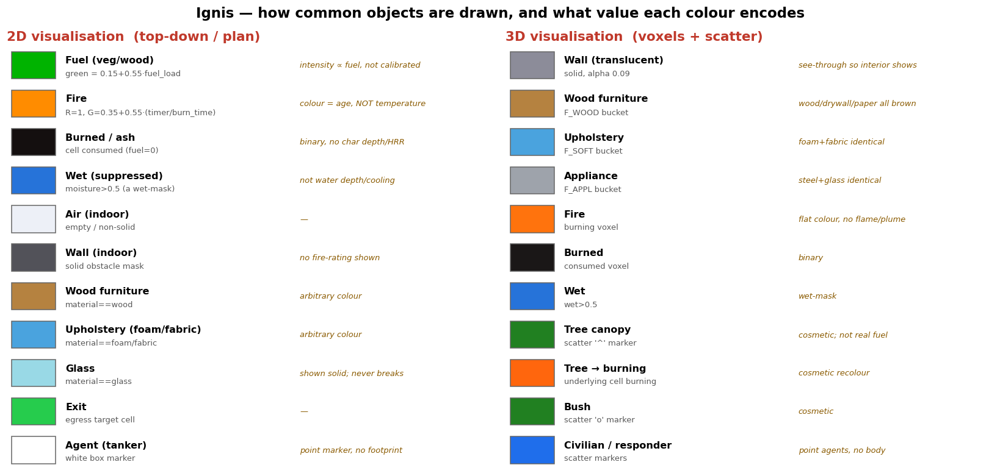

# Ignis — honest deep critique (physics, code, usability, gym comparison)

> A brutal, cited self-review. **Bottom line:** Ignis models the *topology* of fire spread (which cell lights
> next) but discards the *physics* that sets the *rate, intensity, timing, and coupling* of that spread. It is a
> **qualitative spatial-pattern generator** — plausible-looking, but **no output carrying a physical unit**
> (°C, kW/m², seconds, m/s, MJ/m², $) is quantitatively defensible. Use it for RL-environment structure and
> visualization; do **not** cite its numbers as fire-safety predictions.

---

## 1. Physics accuracy — why it is not true to life (cited)

Ignis is a probabilistic cellular automaton: `p_ignite = 1 − (1 − p_base)^E`, `E` = wind/slope- or
buoyancy-weighted burning-neighbour count × a per-material multiplier. No temperature field, no heat-release
rate (HRR), no combustion, uncalibrated `dt`.

### 1.1 CA fire-spread is a tuned pattern-matcher, not physics
- **What Ignis does:** the Alexandridis et al. (2008) form — a base probability modulated by wind/slope
  multipliers (`p_base≈0.27–0.34`, slope gain ~22, wind 0.7).
- **Reality:** Sullivan's (2009) three-part review classifies models as physical (FDS), empirical (Rothermel
  1972 ROS, the basis of FARSITE/NFDRS), and *mathematical-analogue* (CA/percolation). **CA sits in the least
  physical class** — agreement with real burns (Alexandridis reached ~98% on the 1990 Spetses scar) is
  achieved by **black-box tuning to that specific fire**, not by combustion physics.
- **Specific errors:** no calibrated rate-of-spread (Rothermel computes ROS in m/min from an energy balance;
  Ignis has none — spread rate is an artifact of `p_base` and `dt`); **no radiation/convection transport**
  (real flame spread is radiative/convective preheating ahead of the front — FDS solves the radiation transport
  eqn + LES Navier–Stokes; a neighbour count carries no kW/m²); **no firebrand spotting** (even Alexandridis
  added a stochastic spotting sub-model; Ignis's "air = flame carrier" is short-range contiguous flame, not
  ballistic embers); **no fuel-moisture dynamics** (binary, not a continuous ignition-energy sink near the
  ~25–40% moisture of extinction).
- *Refs:* Karafyllidis & Thanailakis (1997) *Ecol. Modelling* 99:87–97; Alexandridis et al. (2008) *Appl. Math.
  Comput.* 204(1):191–201; Rothermel (1972) USDA INT-116; Sullivan (2009) *Int. J. Wildland Fire* (arXiv
  0706.3074/4128/4130); NIST FDS technical reference.

### 1.2 Flashover in seconds is physically impossible
- **Reality:** compartment HRR grows as `Q̇ = α·t²` (NFPA 72/204: even *ultrafast* α=0.1876 kW/s² needs ~75 s
  to reach 1 MW). **Flashover** is a *thermal* criterion — upper-layer **500–600 °C** or floor flux **~20 kW/m²**
  (~1 MW in an ISO 9705 room) — and real time-to-flashover is **~3–8 minutes**, governed by *ventilation-limited*
  critical HRR (`Q̇_fo ≈ 750·A_o·√H_o`), not a count of ignited cells.
- **Error:** if `dt≈1 s`, Ignis "flashover" in single-digit seconds is **~1.5–2 orders of magnitude too fast**,
  and it *mislabels the phenomenon* ("most cells burning" ≠ the discrete 500–600 °C thermal instability). No
  oxygen/vent budget → cannot distinguish a self-extinguishing sealed room from one that flashes over. No
  temperature axis → cannot plot ISO 834 (`T=345·log₁₀(8t+1)+20`) or speak to fire resistance.
- *Refs:* SFPE Handbook; Drysdale *Intro to Fire Dynamics*; Babrauskas flashover correlation; ISO 834/ASTM E119.

### 1.3 "Smoke = air that ever flamed" is not smoke
- **Reality:** smoke is a **buoyant transport** phenomenon — turbulent plume that *entrains* air (McCaffrey
  1979 / Heskestad correlations; smoke mass ≫ fuel mass), a **ceiling jet** (Alpert) that activates
  detectors/sprinklers, and a **descending hot layer** (two-zone models, NIST CFAST).
- **Error:** tagging cells the flame reached means smoke **cannot fill a room ahead of the fire, form a
  descending layer, or travel down corridors** — the opposite of reality, where smoke (the primary cause of
  fatalities) spreads far faster/farther than flame. No optical density, no visibility (m), no CO/HCN → **no
  tenability can be computed.**
- *Refs:* McCaffrey (1979) NBS; Heskestad; Alpert ceiling jet; NIST CFAST (TN 1889).

### 1.4 Materials: arbitrary unit-less multipliers vs measured data
- **Reality:** material fire behaviour is *measured* — **ISO 5660 cone calorimeter** gives HRR (kW/m²),
  time-to-ignition (s), heat of combustion (MJ/kg), soot/CO yields; **ASTM E84** gives Flame-Spread/Smoke
  indices (Class A/B/C). Foam can exceed 1000 kW/m² and ignite in seconds vs FR wood far lower.
- **Error:** Ignis's multipliers are **dimensionless, not test-traceable, and conflated** — one "ignition
  multiplier" cannot separately encode ignitability, HRR, and duration (physically independent). `burn_time`
  "2–6 steps" collapses fuel load + HRR + heat of combustion into a unitless integer; the "$-value" damage has
  no physical basis. **Treating air as a fuel (`p_mult=0.7`, a burn_time) is categorically unphysical** — air
  is the oxidiser.
- *Refs:* ISO 5660-1 (Babrauskas); ASTM E84; ASTM D1929 (ignition temp).

### 1.5 Suppression: a binary wet-mask is not sprinkler physics
- **Reality:** sprinklers are **thermally triggered** (Response Time Index, RTI=τ√u; NFPA 13 fast ≤50 /
  standard ≥80 → activation *tens of seconds to minutes* after the ceiling jet reaches rating) and suppress by
  **evaporative cooling** (latent heat ~2.26 MJ/kg), pre-wetting, and steam O₂ displacement — often *controlling*
  not *extinguishing*, dependent on droplet size / design density (mm/min).
- **Error:** Ignis's wet-mask is **optimistic in every dimension** — instantaneous (no activation delay, the
  single most important variable, impossible without a temperature field), perfect blocking (over-effective),
  permanent (no evaporation/runoff). Direction: makes suppression look **faster and more complete than reality**,
  biasing safety conclusions optimistically.
- *Refs:* NFPA 13; Heskestad & Bill (RTI); SFPE Handbook.

### 1.6 The uncalibrated `dt` invalidates every timing claim
- In a per-step CA, physical spread rate = (voxel/steps-to-cross)×(1/`dt`). With voxel fixed at 0.25 m but `dt`
  free and no physical constraint (no ROS, no HRR, no plume timescale) pinning it, the **same `p_base` yields any
  spread rate**. Therefore **flashover time, ASET, and suppression timing are arbitrary**; even the *stochastics*
  are `dt`-dependent (Bernoulli-per-step). **ASET is uncomputable** (needs a physical clock *and* a
  temperature/smoke field — Ignis has neither), so any `ASET > RSET` safety claim is impossible.
- *Refs:* SFPE Handbook (ASET/RSET, tenability); NIST ASET methodology.

| # | What Ignis does | Real physics | Error & direction |
|---|---|---|---|
| 1 | Tuned neighbour-count Bernoulli CA | Rothermel ROS; FDS CFD; radiation/spotting/moisture | No calibrated ROS; misses transport physics; arbitrary magnitude |
| 2 | "Flashover" in a few steps | t² growth; 500–600 °C / 20 kW/m² / ~1 MW; real 3–8 min | ~10²× too fast; no vent limit; wrong definition |
| 3 | Smoke = air that ever flamed | Plume + ceiling jet + descending layer | Underpredicts smoke; no visibility/toxicity/tenability |
| 4 | Arbitrary dimensionless multipliers | ISO 5660 HRR; ASTM E84 FSI/SDI | No units, not traceable; air-as-fuel unphysical |
| 5 | Binary permanent wet-mask | RTI-triggered cooling (NFPA 13) | Optimistic: no activation delay, over-effective |
| 6 | Uncalibrated `dt` | Physical clock tied to ROS/HRR | All timing arbitrary; ASET uncomputable |

---

## 2. Visualization audit — every common object, 2D vs 3D

Colours are **cosmetic and tied to unit-less internal state**, never to a physical magnitude:
- **Fire** colour = `R=1, G=0.35+0.55·(timer/burn_time)` → encodes **flame *age*, not temperature**.
- **Fuel** green intensity ∝ `fuel_load` (a 0–1 number, not MJ/m²).
- **Burned/glass:** burned is binary (no char/soot); **glass is drawn solid and never breaks** (real fires fail
  glazing early → ventilation change we can't model).
- **3D furniture** is bucketed into 3 colours, so **wood=drywall=paper**, **foam=fabric**, **steel=glass** are
  visually identical despite very different FSI/HRR.
- **3D fire** is a flat orange voxel — **no flame geometry, no plume, no smoke layer** (the defining visuals of
  real fire).
- **Trees/bushes** are **cosmetic scatter markers** recoloured when the underlying cell burns — they are *not*
  real fuel in the CA, so outdoor "vegetation" is decoration.
- **Agents** are point markers with **no footprint/body** (no occlusion/collision volume).

**Verdict:** the visuals communicate *state*, never *magnitude* — you cannot read a real quantity (°C, kW/m²,
visibility) off any frame.

---

## 3. Evacuation model accuracy (cited)

Anchored to `evacuate.py` / `safety.py` (`WALK_MPS=1.2`, `SMOKE_SLOW=0.5`, `DETECTION_S=20`, `PREMOVE_S=15`,
`UNTENABLE=0.30`).

- **3.1 Speed is a fixed constant, not density-dependent.** `_cells_per_step` gives a flat 1.2 m/s (×0.5 in
  smoke); agents don't interact and can share a cell. Real emergency movement is a *decreasing function of
  crowd density* — Nelson & Mowrer (SFPE) `S = k − a·k·D`: free (~1.2–1.4 m/s) only below ~0.54 p/m², →0 at jam
  ~3.8 p/m². **Error:** Ignis models free-flow only, systematically *underestimates* egress time at any real density.
- **3.2 No crowd dynamics / bottlenecks / exit capacity.** Agents are non-interacting points; the exit has
  **infinite throughput** (escape the instant `dist==0`), so 10 vs 1000 occupants clear a door in the same time.
  The real rate-limiter is the **door/stair bottleneck** (effective-width flow), plus queuing/clogging and the
  **"faster-is-slower"** effect (Helbing, Farkas & Vicsek, *Nature* 2000). **Error:** Ignis structurally *cannot*
  evaluate exit width/number/placement — the very variables `safety.py` claims to compare (a 2nd exit helps only
  by shortening path length, never by relieving congestion).
- **3.3 Pre-movement is a constant, not a distribution.** `PREMOVE_S=15`, `DETECTION_S=20` applied identically
  to all occupants. Real pre-movement is a wide, positively-skewed (log-normal) random variable whose **slow
  tail dominates RSET** (Purser & Bensilum, *Safety Science* 2001; PD 7974-6 uses percentiles). **Error:** throws
  away the largest source of RSET variance and the tail that actually causes casualties.
- **3.4 Tenability = "cell on fire" — no FED/visibility/heat.** An occupant dies only on *flame contact*; smoke
  merely halves speed. But **most fire deaths are smoke/toxic-gas inhalation and heat, before flame contact**.
  ISO 13571 prescribes **FED** (CO/HCN/O₂), **visibility/optical density**, and **radiant/convective heat** dose
  at head height. **Error:** occupants walk unharmed through lethal smoke/hot gas. *Implementation bug:*
  `safety.py` declares `HEAD_M=1.7` ("tenability at head height") but `compute_aset` collapses z with `.any(axis=2)`
  and never uses it.
- **3.5 ASET/RSET are not defensible PBD numbers.** Ignis's ASET = time for 30% of cells to be
  burning-or-smoky (an arbitrary *geometric coverage fraction*, not a tenability threshold, not location-specific);
  RSET inherits every defect above; both are squashed into a sigmoid "safety score" that *looks* like a
  code-compliance metric but is traceable to no standard (SFPE PBD requires location- and time-resolved tenability
  vs a distribution-based RSET with an explicit margin). **It would not be accepted in any real submission.**
- *Refs:* Nelson & Mowrer / NIST movement speeds; ETRR (2017) fundamental-diagram review; Helbing, Farkas &
  Vicsek (2000) *Nature* 407:487; Purser & Bensilum (2001) *Safety Science*; ISO 13571; Hurley & Rosenbaum,
  *Performance-Based Fire Safety Design* (SFPE/CRC 2015).

## 4. Ignis as a Gym environment vs the field (cited)

Anchored to `gym_env.py` (`Discrete(13)`, `Box(0,1,(13,))`, reward `saved − prev`), `suppress.py` (linear
`N_ACT×N_ACT` CEM policy), `marl.py`. Repo-wide `test*.py` → **0 files**.

| Dimension | Ignis | Field (JaxWildfire, SimFire/SimHarness, Cell2Fire, ALE/MuJoCo/MiniGrid/PettingZoo/Gymnax) | Weaker? |
|---|---|---|---|
| **Observation** | 13-vector of **privileged global** burning fractions + budget; fully observed, no sensor/occlusion/noise | ALE/MiniGrid impose *partial observability*; SimFire layered fuel/elevation/fire channels | **Yes** — toy obs; rewards a trivial "spray hottest zone" |
| **Action** | `Discrete(13)` (one zone or no-op) | continuous control (MuJoCo), 18-action long-horizon (ALE), spatial firelines (SimHarness) | Comparable to simplest envs; shallow with the obs |
| **Reward** | telescoping `Δ fuel_saved` | SimHarness weighs land value/resources/damage; ALE native score | **Yes** — trivially saturated; a 1-line heuristic ≈ the learner |
| **Determinism** | `reset(seed)` ok, **but** `__init__` mutates **global module state** (`SimConfig.apply`, `set_terrain`) → two envs in a process clobber each other; no repro tests | Gymnax/JaxMARL bit-exact via functional PRNG; ALE standardised protocol | **Yes** |
| **Vectorisation** | **single-env CPU NumPy**, no vmap/GPU | JaxWildfire **6–35×**; Gymnax/JaxMARL up to **~1000–12500×**; SimHarness RLlib workers | **Yes, by orders of magnitude** |
| **Real data** | procedural / one hand-authored `house.json`; toy CA | JaxWildfire ESA WorldCover+DEM; SimFire LANDFIRE-style; Cell2Fire Canadian FBP | **Yes — none** |
| **Tests/docs** | docstrings + MD; **no tests, no CI, no `env_checker`** | PettingZoo/Gymnasium/ALE ship test suites + conformance checkers | **Yes — the biggest concrete gap** |
| **API compliance** | modern 5-tuple `step`, `reset(seed)`, `register` — **correct shape** | Gymnasium v0.26+ terminated/truncated | ~parity (the least-weak axis); but `render()` unimplemented indoors, no `env_checker` run |
| **Benchmarking** | one metric (% fuel saved) vs one heuristic baseline, no seed variance, no PPO/DQN comparison in the env | ALE: many seeds, human-normalised, reported variance | **Yes** |
| **Multi-agent** | `marl.py` = **scripted** heuristic responders + shortest-path civilians on **one** scene; no PettingZoo, no learned MARL | PettingZoo AEC/Parallel API; JaxMARL GPU MARL; SimHarness multi-agent RLlib | **Yes, substantially** |

**Verdict:** a clean, honest **single-agent CPU/NumPy prototype** with correct Gym API *shape* — but materially
weaker than every named peer on throughput, real-data grounding, tests/reproducibility, benchmarking rigor,
observation depth, and multi-agent framework. Several gaps are self-acknowledged as "next steps" in the
docstrings. *Refs:* JaxWildfire (arXiv:2512.06102); SimFire/SimHarness (MITRE, arXiv:2311.15925); Cell2Fire
(arXiv:1905.09317); PettingZoo (arXiv:2009.14471); JaxMARL (arXiv:2311.10090); ALE "Revisiting" (arXiv:1709.06009).

## 5. Code review — correctness, API, usability

Full line-by-line review. The sim core is competent and honest about being an abstract CA, but it's built on
**module-global mutable state** that breaks the "reusable Gym env" it sells, has **zero tests**, several
**unvalidated-input crash/silent-corruption paths**, and rebuilds matplotlib figures inside hot loops.

### 🔴 Critical
- **C1 — `fire_env` module globals make the Gym env non-reentrant / break vectorization.**
  `fire_env.py:32-36` (`N,_YS,_XS,TERRAIN,_SN…` global) + `gym_env.py:38-40`. `IgnisWildfireEnv.__init__` calls
  `SimConfig(n).apply()` → `set_grid()` rebuilds globals and `set_terrain(None)`. **Two envs in one process
  clobber each other**: constructing a 2nd wildfire env silently wipes the 1st env's terrain/slope; mixing
  `n=48` and `n=64` → `ValueError: operands could not be broadcast` on the next `step()`. This directly breaks
  SB3 `make_vec_env`. *Fix: move model state into an instance/`FireModel`, stop mutating globals in `__init__`.*
- **C2 — No tests at all, no Python CI.** Zero `test_*` files; the only workflow builds the deck. Every README
  number is unverifiable/unguarded.
- **C3 — Unvalidated floorplan input → crash or silent corruption.** `schema.validate_floorplan` only checks
  `dims` + bbox length + material names. `ignition:[[100,100,1]]` → `IndexError`; `[[-1,-1,1]]` **wraps silently**
  (numpy negative index) and ignites the far corner; furniture stamped **after** walls can **un-solidify a wall**
  (fire leaks through); reversed bbox → empty slice, furniture vanishes with no error. *Fix: validate all coords
  vs `dims`, enforce ordering, reject ignition in `solid`.*

### 🟠 Major
- **M1 — Small grids crash `init_state`.** `fire_env.py:84` `rng.integers(8, N-8, B)` → `ValueError: low>=high`
  for `N≤16`, yet README advertises "any size". *Fix: scale ignition margin with N; assert a minimum.*
- **M2 — Toroidal wrap-around in the indoor kernel.** `indoor_env.py:54-58` uses `np.roll` on all axes → a
  burning voxel at index 0 seeds index `nx-1` (and ceiling↔floor). Only masked because scenes wrap themselves in
  a solid perimeter; any hand-authored scene with combustible touching a face spreads across the building
  instantly. *Fix: zero the wrapped plane, or pad-and-slice.*
- **M3 — Ignition "probability" can exceed 1.** `indoor_env.py:60` `p = (…)*p_mult` with `p_mult` up to **1.8**
  (foam)/1.6 (paper) → `p>1` → deterministic ignition; the "probability" is meaningless there. *Fix: fold p_mult
  into the exponent or clip.*
- **M4 — Reward is always ≤ 0.** `gym_env.py:105` `reward = saved − prev` and fuel is monotonically
  non-increasing → best per-step reward is 0, the agent never sees positive reinforcement, indoor episodes carry
  only ≈ −0.3…−0.5 of signal over 90 steps (tiny gradients — **a likely reason PPO loses to CEM**). Telescoping
  is mathematically correct but a poor signal. *Fix: reward vs a do-nothing rollout, scale ×100, or add a terminal bonus.*
- **M5 — Rendering rebuilds a full matplotlib figure per frame.** `render3d.py`, `playthrough.py`, `marl.py`,
  `evals.py` all `plt.figure()`+`ax.voxels()` (slow) per grabbed frame; `regenerate.py` runs ~6 serially → many
  minutes + memory balloon. *Fix: reuse one fig, update collections, or drop `voxels`.*
- **M6 — Generated scenes have an unreachable exit; occupants "escape through walls".** `generate.py:95` emits
  no `exits`/perimeter door → `evacuate.py:32` falls back to `[nx//2, 0]` (a solid wall cell); the greedy move
  loop `:91-99` follows the gradient but **never checks `static_block`**, so agents step *onto* the wall to
  "escape" — and if that column is an interior wall, the exit is unreachable and **everyone dies with no error.**
  *Fix: generator must place a real door + `exits`; move loop must forbid stepping into `static_block`.*
- **M7 — Packaging/version mismatches.** `__init__.py:4` says `0.1.0`, `pyproject` says `0.2.0`;
  `requirements.txt` omits `gymnasium`/`sb3` so the README `gym.make` example fails after `pip install -r
  requirements.txt`; the `gymnasium.envs` plugin entry point is untested on a clean install.
- **M8 — README headline numbers are internally inconsistent.** Table says **43.9% → 55.2%**; prose says
  **47% · PPO 56% · CEM 60%**. Both can't be the held-out baseline. (Exactly what C2's missing tests would catch.)

### 🟡 Minor (selected)
- `indoor_env.py:73-78` burning **air** voxels are never marked `burned` → unbounded re-flash loop by
  construction (usually decays, but delays the `burning==0` termination).
- `generate.is_connected()` **exists but is never called** by `generate_scene`/`sample_pool` (only in `__main__`)
  — README's "connectivity-checked" is only true *by construction*.
- `safety.py:84` when `_max_travel_m` returns the `-1.0` sentinel, the score term becomes `1.033`, **inflating
  the safety score above its cap**; `compute_rset` runs fire+evac together so `ASET−RSET` double-counts fire.
- `materials._column` re-imports numpy and rebuilds lookup arrays ~6×/`init_from_scene` (cache them).
- **Duplication:** the CEM loop is copy-pasted 5× (`train`, `train3d`, `suppress`, `hpo_compare`, `marl_train`);
  the "grab `fig.canvas.buffer_rgba` → gif" block is duplicated 6×. Extract `cem(...)` and `frames_to_gif(...)`.

### What should be tested (currently nothing)
env-checker on both envs + `reset(seed)` reproducibility + two-envs-don't-corrupt (C1); grid reconfig n∈{17,32,48,64}
(M1); importer validation (out-of-bounds/reversed-bbox/wall-not-cleared, C3); single-voxel-adjacent-to-face doesn't
ignite the opposite face (M2); `apply_action(a)` wets the zone `observe` reports at index `a`; `is_connected` true
across seeds and actually called (M6); evacuation never steps onto `static_block`; metric bounds + `p` clip (M3).

---

## 6. Recommendations (incl. your indoor≠outdoor backend idea)

**A. Fix the honesty gaps first (cheap, high-trust):** reconcile the README numbers from a committed eval script;
add `CRITIQUE.md`'s limitations to the README; single-source the version; add `gymnasium` to `requirements`.

**B. Fix the real bugs (C1, C3, M2, M3, M6):** de-globalize `fire_env` into a `FireModel` instance; validate
floorplan coords; stop `np.roll` wrap; clip/normalize `p`; place real exits + block-aware movement. Add the test
suite above + `env_checker` in CI.

**C. Different backends for indoor vs outdoor — yes, do it.** The CA is the wrong tool to *quote numbers* from;
keep it only as the fast RL surrogate, and add a pluggable physics backend behind the `VoxelScene` API:
- **Outdoor:** a **Rothermel/FARSITE-grounded** rate-of-spread backend (real fuel/DEM via LANDFIRE/WorldCover, ROS
  in m/min, wind/slope from the energy balance) — matches JaxWildfire's data grounding.
- **Indoor:** a **two-zone model (CFAST-style)** or coarse CFD for the *reference* runs — real HRR (t²), a
  descending smoke layer, temperature, and RTI-triggered sprinklers — so ASET/RSET, flashover time, and tenability
  (FED/visibility/heat) become *defensible* numbers. Train RL on the fast CA, **validate/report on the physics backend.**
- **Reward:** make it a proper dense advantage vs do-nothing; **evacuation:** add a speed–density fundamental
  diagram + finite exit capacity (even the SFPE effective-width flow) so exit *width* actually matters.

**D. Honest positioning:** Ignis is a **pedagogical, config-driven RL prototype** with a correct Gym API shape and
a genuinely novel *indoor-structural* framing — not a validated fire model or a benchmark peer of JaxWildfire /
SimFire / Cell2Fire. Say that plainly; it's a strength, not a weakness, for a hackathon.
