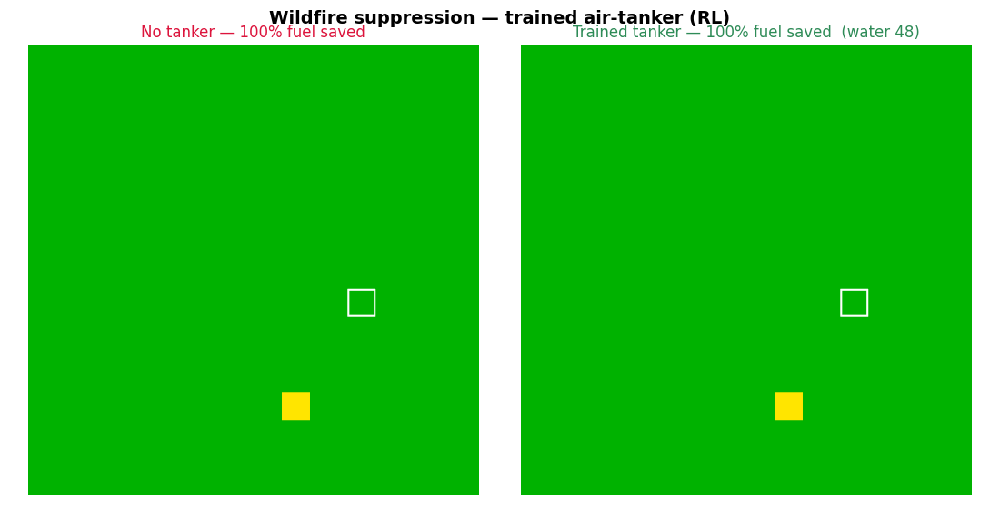
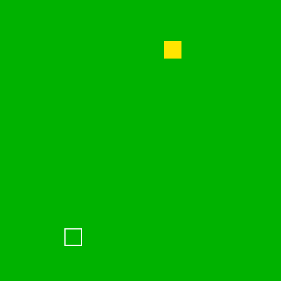
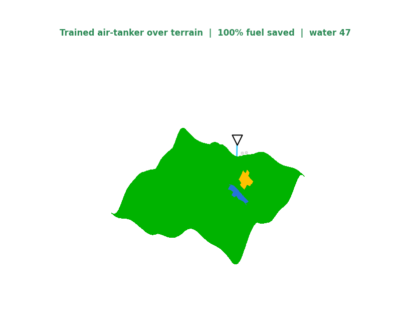
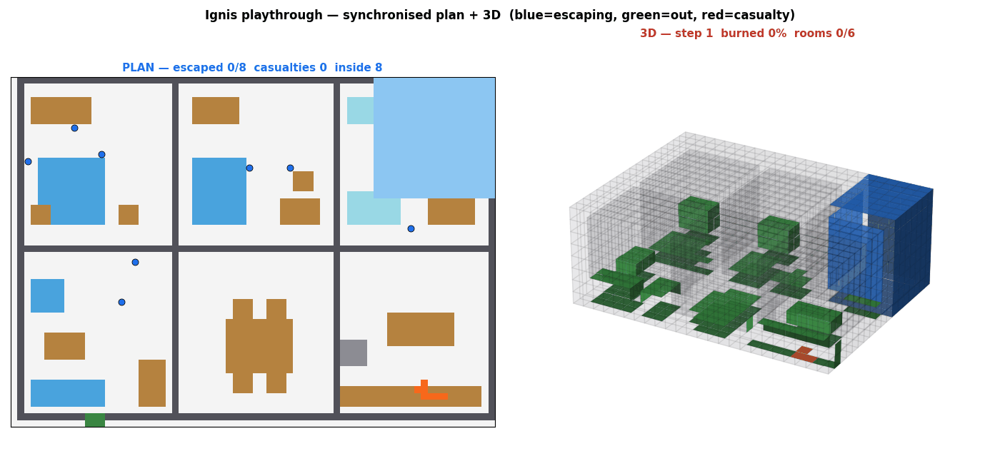
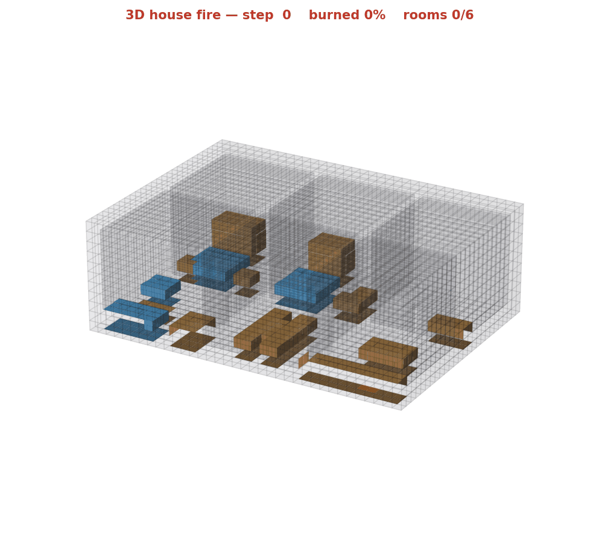
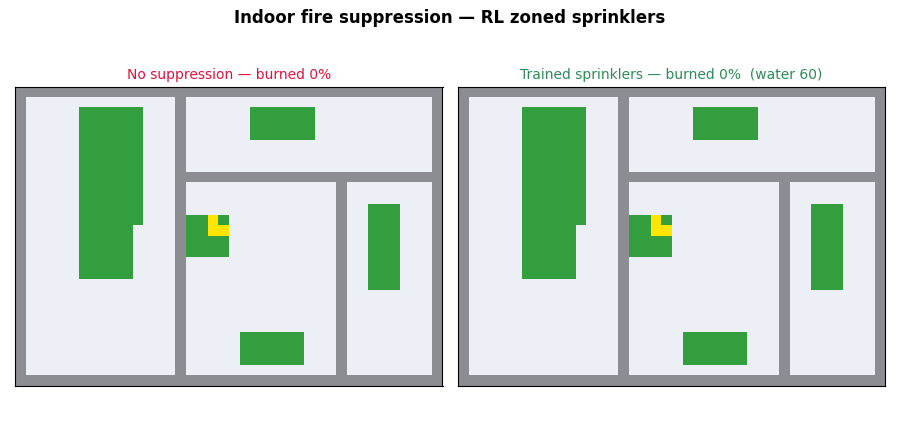
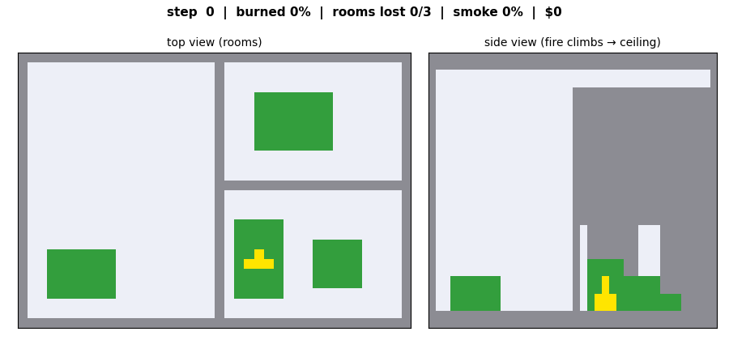
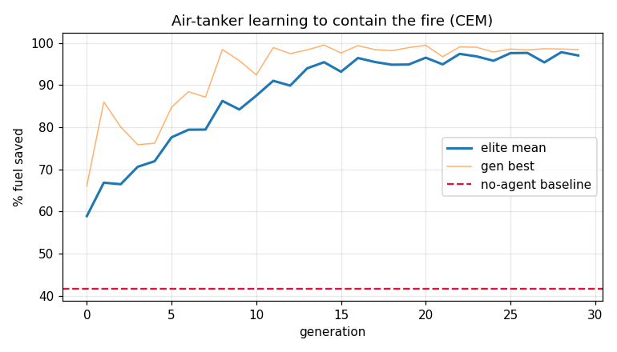
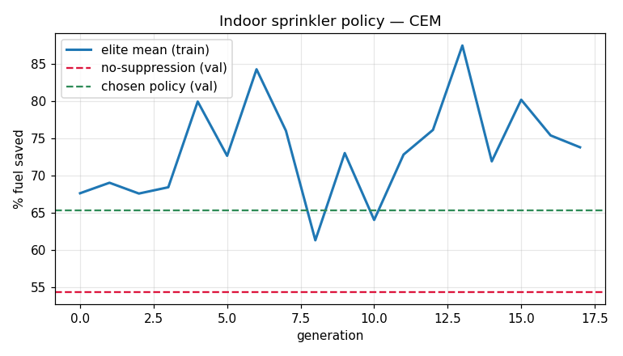

# 🔥 Ignis

**A fast fire-spread simulator and reinforcement-learning suppression sandbox — wildfire today, indoor next.**

Ignis simulates fire spreading through an environment and trains an agent to put it out.
It runs in pure NumPy (no GPU, no heavy deps), so it clones and runs anywhere in seconds,
yet it already shows the full loop: **simulate spread → train a suppression policy → measure the outcome.**

> 🗓️ Built at a **6-hour hackathon** — [event on Luma](https://luma.com/8e27tzl0).
> 📊 **Live presentation (10 pages):** https://tyronita.github.io/ignis/
> Hackathon MVP (v0.1). Built to be built upon — see the [roadmap](#roadmap).
>
> **Reproduce everything with one readable script:** [`scripts/regenerate.py`](scripts/regenerate.py) (or `./run.ps1` / `./run.sh`) — trains the agents, saves every GIF below, runs the indoor eval, and syncs media into the presentation.

---

## What it does

| | |
|---|---|
| **Outdoor wildfire (2D)** | Wind-driven cellular-automaton fire; an air-tanker RL agent learns *where* to drop water to save the most fuel. |
| **Outdoor wildfire (3D terrain)** | Same fire lifted onto an elevation heightmap — **fire climbs uphill** (slope-coupled spread) and the tanker is retrained on the hills. |
| **Indoor building (3D voxel)** | A JSON floorplan is converted to a voxel scene with **materials**; fire **climbs, fills rooms top-down, and crosses doorways**, scored by an **eval harness** (damage, rooms lost, flashover). |

### Results

| Scenario | No-agent baseline | Trained agent |
|---|---|---|
| Wildfire, flat | **41.7%** fuel saved | **~98%** |
| Wildfire, hilly terrain | **63.9%** fuel saved | **99.6%** |
| Indoor, RL zoned sprinklers (held-out buildings) | **43.9%** fuel saved · $698 | **55.2%** · $573 |

*(Indoor is measured on held-out generated buildings; a greedy oracle reaches 100% fuel saved, so the linear policy has clear headroom.)*

<p align="center">
  <br/>
  <em>Same fire, no tanker (left) vs. the trained air-tanker (right).</em>
</p>

<p align="center">
  
  <br/>
  <em>Left: trained tanker containing a fire. Right: 3D terrain scene — fire climbs uphill, tanker drops water from above.</em>
</p>

<p align="center">
  <br/>
  <em><b>One run, two synchronised views</b> — architectural <b>plan</b> (left) + <b>3D</b> (right). Fire + RL suppression + evacuation together; occupant <b>trajectories</b> overlaid (blue = escaping, green = out, red = casualty). House run: <b>8/8 escaped in 17 s</b>.</em>
</p>

**Two tasks** (see [TASKS.md](TASKS.md)): **1) RL fire suppression** (zoned sprinklers, CEM) · **2) evacuation** (fire-aware shortest path, real 1.2 m/s walking, trajectory recording). Real constants: 0.25 m voxels, `dt = 1 s`.

<p align="center">
  <br/>
  <em>A realistic <b>15×11×5 m house</b> (5 rooms, real furniture — sofa, beds, kitchen island, wardrobes) built upward from the floor plan; fire ignites in the kitchen and climbs. Slow 3D orbit, 0.25 m voxels.</em>
</p>

<p align="center">
  <br/>
  <em>Indoor fire: no suppression (left) vs. the RL-trained zoned sprinklers (right).</em>
</p>

<p align="center">
  <br/>
  <em>Top view (room-to-room spread) + side view (plume climbs, ceiling fills).</em>
</p>

<p align="center"> </p>

## Use it as a Gym environment
Ignis ships as a **Gymnasium** environment so anyone can train their own agents:
```python
import gymnasium as gym
import ignis.gym_env                       # registers the envs
env = gym.make("Ignis-Indoor-v0")          # 3D structural-fire suppression (novel)
# env = gym.make("Ignis-Wildfire-v0")      # 2D wildfire (baseline; cf. JaxWildfire)
obs, info = env.reset(seed=0)
obs, reward, terminated, truncated, info = env.step(env.action_space.sample())
```
`Ignis-Indoor-v0`: `Discrete(13)` action (4×3 sprinkler zones + no-op), observation = per-zone burning +
water budget, reward = fuel saved. It is a **solvable** env — a greedy oracle reaches 100% fuel saved.

Because it's a standard Gym env, **deep RL drops in**:
```python
from stable_baselines3 import PPO          # pip install stable-baselines3
model = PPO("MlpPolicy", "Ignis-Indoor-v0").learn(150_000)
```
We train **both** and compare (same env): **CEM** (black-box policy search) vs **PPO** (deep RL, MLP policy).
Held-out: no-agent **47%** · PPO **56%** · **CEM 60%** — see `assets/cem_vs_ppo.png`. Honest finding: **CEM edges
PPO** here — a known result on low-dimensional control (CEM is a strong, tuning-free baseline).

## Wins so far
- ✅ 2D wildfire CA + air-tanker RL — **41.7% → ~98%** fuel saved
- ✅ 3D slope-coupled terrain (fire climbs uphill) — **63.9% → 99.6%**
- ✅ **3D structural/indoor fire** (rooms, walls, doors, materials, buoyancy) — *novel vs JaxWildfire*
- ✅ **Procedural building generator** (seeded, connectivity-checked) → unlimited RL distribution
- ✅ **RL suppression** via zoned sprinklers, CEM-trained across the distribution
- ✅ **Gymnasium env** (`Ignis-Indoor-v0` / `-Wildfire-v0`) — reusable by others
- ✅ **Spatial fire dataset export** with a provenance manifest (data pillar)
- ✅ **Evacuation task** — occupants escape via fire-aware shortest path (real 1.2 m/s), trajectories recorded; house: **8/8 out in 17 s**
- ✅ **Synchronised plan + 3D playthrough** — both views time-locked, every run
- ✅ **Realistic furnished house** — 18×13×5.5 m, 6 rooms, dining set (table + 4 chairs), beds, sofas, kitchen, bathroom, front-door exit
- ✅ **PPO (deep RL)** trained on the Gym env + honest **CEM-vs-PPO** comparison (CEM is competitive)
- ✅ **Two-class MARL** — fire-engine **responders** (engine + operators) vs **civilians**; responders ~halve fire damage
- ✅ **Safety scorer** (ASET − RSET) + **California standards** + **materials grading** — [SAFETY.md](SAFETY.md)
- ✅ Configurable real dimensions (0.25 m voxels, `dt=1 s`), full **equations in [PHYSICS.md](PHYSICS.md)**, tasks in [TASKS.md](TASKS.md)

---

## How the current model works

The spread model is a **probabilistic cellular automaton** (fast, RL-friendly) — **not** a fluid solver.
Each step, a non-burning fuel cell ignites with probability

```
p_ignite = 1 − (1 − p_base) ^ (effective burning neighbors)
```

where *effective neighbors* are weighted by **wind** and **terrain slope** (outdoor) or by
**buoyancy** — fire prefers to climb, then spreads along the ceiling — and **materials** (indoor).
Moisture/water and walls gate ignition. Burning cells count down, then become ash.

The agent is a tiny linear policy trained with the **Cross-Entropy Method (CEM)** — gradient-free,
no tuning, converges in seconds. Reward = fraction of fuel saved.

> **Note:** Ignis does **not** use JaxWildfire — this is an independent NumPy implementation of the
> same *model class* (probabilistic CA). JaxWildfire is our documented GPU scale-up path
> (see [REFERENCES.md](REFERENCES.md)). No real CFD/fluid solver runs in the loop, by design.

---

## Quickstart

```bash
pip install -r requirements.txt

# reproduce every artifact (train + all gifs + indoor eval)
python scripts/regenerate.py          # or:  ./run.ps1   /   ./run.sh

# live windows
python -m ignis.viz2d                  # 2D side-by-side, live
python -m ignis.scene3d                # 3D terrain scene, live rotating

# indoor pipeline
python -m ignis.indoor.importer ignis/indoor/examples/apartment.json
python -m ignis.indoor.evals    ignis/indoor/examples/apartment.json
```

Grid size is configurable (no hardcoded `N`):

```python
from ignis import SimConfig
SimConfig(n=64).apply()   # any size; indoor uses independent (nx, ny, nz)
```

---

## Architecture

```
scene (JSON floorplan / USD* / mesh*)  ──importer──►  "our format" (VoxelScene)
                                                          │
   fire_env (2D CA) ── config(n) ──┐                      ▼
                                   ├─► spread model ──►  eval harness (damage, rooms, flashover)
   indoor_env (3D voxel CA) ───────┘                      │
                                                          ▼
                          CEM-trained suppression policy (air-tanker; indoor agent = next)
   *USD / mesh voxelizer = experimental preset, not default
```

The sim consumes only the **VoxelScene** format, so any front-end (JSON, USD, voxelized mesh)
plugs in without touching the physics — and JaxWildfire/PyTorchFire can replace the spread core
behind the same interface.

## Repo layout

```
ignis/            engine + training + viz (fire_env, train, viz2d, scene3d, config)
ignis/indoor/     schema, materials, importer, indoor_env, evals, examples/apartment.json
assets/           all GIFs + curves
scripts/          regenerate.py — reproduces everything
presentation/     React (Vite) pitch deck
```

## Roadmap

- [ ] Indoor **suppression** agent (sprinkler activation / firefighter) trained against the eval harness
- [ ] **Budgets** as hard constraints in the RL loop (water / time / compute)
- [ ] **USD / mesh voxelizer** importer (experimental preset → default-quality)
- [ ] **JAX** backend swap (JaxWildfire/PyTorchFire) for GPU-scale training
- [ ] Photoreal render layer (PyVista → Unreal Niagara / FieryGS) consuming the same state

See [REFERENCES.md](REFERENCES.md) for sources and design rationale, and [CHANGELOG.md](CHANGELOG.md) for build history.

## License
MIT (see repo).
